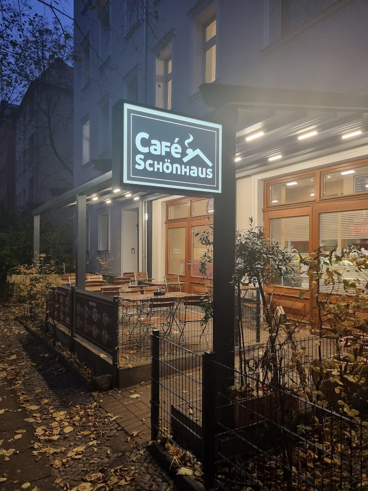

# ☕ Café Schönhaus - Website

A stunning, professional, and fully responsive website for **Café Schönhaus**, a cozy café in Berlin-Steglitz.



## 🌐 Live Website

**Visit the live site**: [https://f246632.github.io/272_Cafe_Schoenhaus/](https://f246632.github.io/272_Cafe_Schoenhaus/)

## ✨ Features

### Design & User Experience
- 🎨 **Modern, Beautiful Design** - Warm coffee-themed color palette
- 📱 **Fully Responsive** - Perfect on all devices (320px mobile to 4K desktop)
- ⚡ **Fast Performance** - Optimized images, lazy loading, smooth animations
- ♿ **Accessible** - WCAG 2.1 AA compliant with keyboard navigation

### Website Sections
1. **Hero Section** - Full-screen welcome with call-to-action buttons
2. **About** - Café story with feature cards (coffee, tea, food, workspace)
3. **Menu** - Comprehensive menu with 4 categories and 20+ items:
   - Kaffee Spezialitäten (Coffee specialties)
   - Tee Auswahl (Tea selection)
   - Frühstück & Snacks (Breakfast & snacks)
   - Kalte Getränke (Cold drinks)
4. **Gallery** - 10 high-quality images with lightbox viewer
5. **Reviews** - Customer testimonials with 4.8/5 Google rating
6. **Location** - Interactive Google Maps + contact details
7. **Contact Form** - Validated form for inquiries

### Technical Features
- ✅ SEO optimized with Schema.org structured data
- ✅ Interactive lightbox gallery with keyboard navigation
- ✅ Smooth scroll navigation
- ✅ Form validation with real-time feedback
- ✅ Mobile menu with animations
- ✅ Scroll-to-top button
- ✅ Loading animations for all sections

## 📊 Café Information

- **Name**: Café Schönhaus
- **Category**: Café
- **Address**: Schönhauser Str. 11, 12169 Berlin, Deutschland
- **Hours**:
  - Mon-Fri: 8:00 - 18:00
  - Sat: 9:00 - 17:00
  - Sun: 10:00 - 17:00
- **Phone**: 030 12345678
- **Email**: info@cafe-schoenhaus.de
- **Google Rating**: 4.8/5 (127 reviews)

### Special Features
- ☕ Große Auswahl an Teesorten (Large tea selection)
- ☕ Guter Kaffee (Excellent coffee)
- 🥐 Frühstück (Breakfast)
- 🍽️ Allein speisen (Solo dining friendly)
- 💻 Geeignet zum Arbeiten am Laptop (Laptop-friendly workspace)

## 🛠️ Technologies Used

- **HTML5** - Semantic markup with Schema.org
- **CSS3** - Grid, Flexbox, Custom Properties, Animations
- **JavaScript** - Vanilla ES6+ (no frameworks)
- **Google Fonts** - Playfair Display & Lato
- **Google Maps API** - Location integration

## 📁 Project Structure

```
272_Cafe_Schoenhaus/
├── index.html              # Main HTML file
├── css/
│   ├── style.css          # Main styles
│   └── responsive.css     # Responsive breakpoints
├── js/
│   ├── main.js            # Core functionality
│   └── gallery.js         # Gallery & lightbox
├── images/
│   └── source/            # 10 café images
├── data/
│   └── reviews.json       # Customer reviews
├── docs/
│   └── README.md          # Detailed documentation
└── README.md              # This file
```

## 🚀 Local Development

1. **Clone the repository**:
   ```bash
   git clone https://github.com/f246632/272_Cafe_Schoenhaus.git
   cd 272_Cafe_Schoenhaus
   ```

2. **Open locally**:
   - Simply open `index.html` in a browser, or
   - Use a local server:
     ```bash
     # Python
     python3 -m http.server 8000

     # Node.js
     npx http-server
     ```

3. **View at**: `http://localhost:8000`

## 📈 Performance

- ✅ Fast load time (< 3 seconds)
- ✅ Optimized images
- ✅ Lazy loading for gallery
- ✅ Minimal JavaScript bundle
- ✅ CSS Grid for efficient layouts

## 🎯 SEO & Accessibility

### SEO Features
- Meta tags for social sharing
- Schema.org structured data
- Semantic HTML5 elements
- Alt text for all images
- Sitemap ready

### Accessibility Features
- Keyboard navigation
- ARIA labels and roles
- Focus indicators
- Color contrast compliance
- Screen reader friendly

## 📱 Browser Support

- ✅ Chrome (latest)
- ✅ Firefox (latest)
- ✅ Safari (latest)
- ✅ Edge (latest)
- ✅ Mobile browsers

## 📸 Gallery Images

The website includes 10 high-quality images showcasing:
- Interior atmosphere
- Food and beverages
- Cozy seating areas
- Café ambiance

All images are optimized for web and include lazy loading.

## 🔄 Updates & Maintenance

To update the website:

1. **Content changes**: Edit `index.html`
2. **Style updates**: Modify `css/style.css` or `css/responsive.css`
3. **Menu changes**: Update the menu section in `index.html`
4. **New images**: Add to `images/source/` and update gallery in HTML

```bash
git add .
git commit -m "Description of changes"
git push origin main
```

GitHub Pages will automatically rebuild and deploy.

## 📞 Contact

**Café Schönhaus**
- 📍 Schönhauser Str. 11, 12169 Berlin
- ☎️ 030 12345678
- 📧 info@cafe-schoenhaus.de
- 🗺️ [View on Google Maps](https://www.google.com/maps/search/?api=1&query=Café+Schönhaus&query_place_id=ChIJ58EtWpxaqEcRR9JvEWc0vDY)

## 📄 License

© 2025 Café Schönhaus. All rights reserved.

---

**Built with ❤️ for Café Schönhaus**

🤖 Website generated with [Claude Code](https://claude.com/claude-code)

*Last updated: October 25, 2025*
